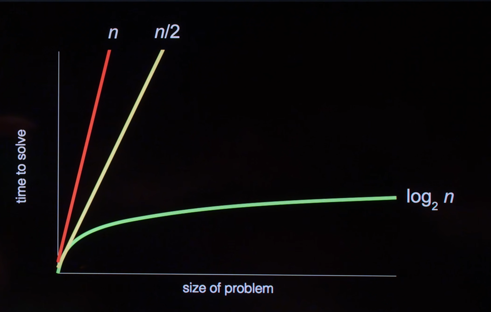

So how did we get from binary, 0s and 1s to theses complex chatbots.
What compter science is simply problem solving, and all the programming languages, algortihms etc. is just the tool to get there.

---
# Binary
The binary system is what all computers understand.
**Analogy -** 
0 : Bulb off
1 : Bulb On

In the human world we deal with base-10 system (Decimal System)

Like 123 is 3 ones 2 tens and 1 hundreds in decimal systems, 
similarly 101 in binary is two to the power 0 plus two to the power 2 thus resulting in 5.

here 0 and 1 corresponds to binary digits, or the shorthand is bit.

Using 3 bits we can store to 7
with 4 we can do to 15. etc.

So we use now move up from bit to byte
1 byte = 8 bits
and the hierarchy follows to kilobytes, megabytes, gigabytes etc.

---
# ASCII
How does the computer stores "A" in its binary dependent environment.
So we agan use a pattern of 0s and 1s to interpret "A".

**PROBLEM:** We also want it to be consistent in all the devices we use, we want to the sequence of 0s and 1s to be same every-where.

**SOLUTION:** We created a convention that we will use 65 to denote A and then it was fairly consistent 66 = B, 67 = C, etc. This convention is known as ASCII.

All the special characters and values except integers are interpreted in the 8-bit sized ascii code.

---
# UNICODE
**PROBLEM:** We don't only have english as the only language or the symbols. So we can't have only-8 bit (256 possible charachters) to describe it.

**SOLUTION:** We use UNICODE which is in a sense superset of ASCII where we use a dataset of 32-bits (Which gives us about 4 billion unique charachter) which seems enough for our requirements of all the emojis, language charachters, etc.

*Continuum* - Colours, Musical Tones, images, pixels, videos etc. are nothing but an application of similar approach to use binary and numbers.

---
# Algorithm

By definition, it corresponds to the **approach** or the **solution** to a problem. An algorithm or a *good* algorithm should be a one which uses the least amount of power or memory or whatever the given constraints are, **and** does the job it is assigned.

Usually we use an approach based on the time performace as depicted best by a graph from the lecture : 

**Pseudocode:** It's the process of writing problem-set, steps of solution, and all other information in an oreder in which our algorith will work upon.
